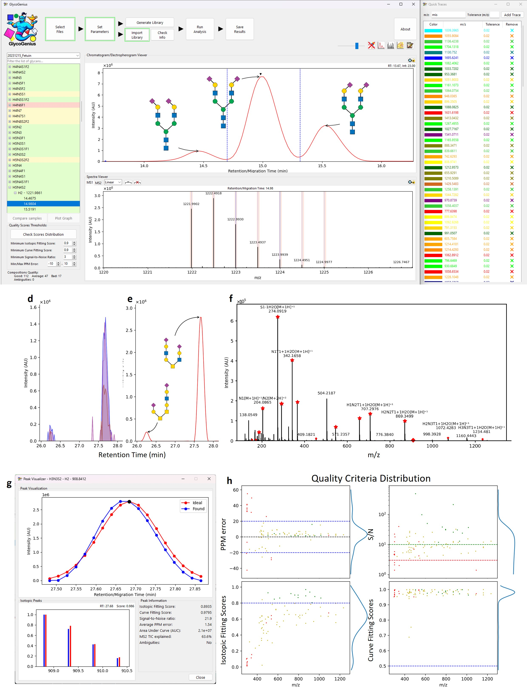
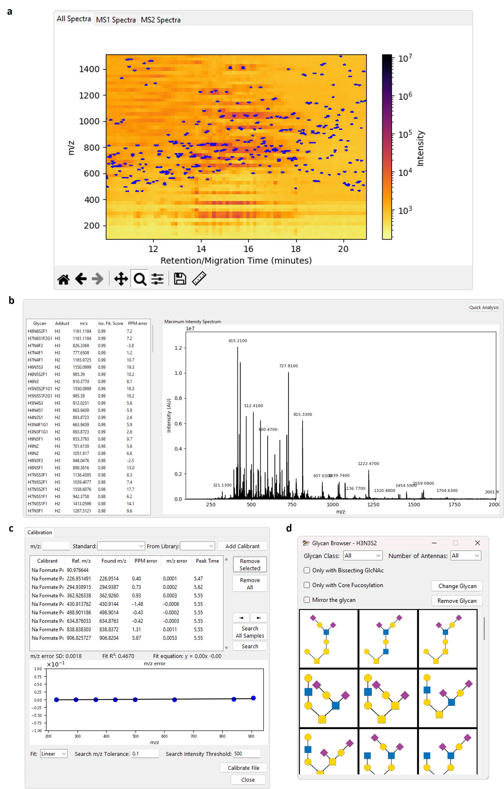

# GlycoGenius - The Ultimate Glycomics Data Analysis Tool

GlycoGenius is an open-source program offering an automated workflow for glycomics data analysis, featuring an intuitive graphical interface. 

Current software tools are effective in certain aspects of glycomics data analysis but all require significant effort to reach satisfactory qualitative results, often requiring months of manual data curation, revision and integration.

With that in mind, GlycoGenius is tailored to reduce manual workload. It allows for data visualization and automatically constructs search spaces, identifies, scores, and quantifies glycans, filters results, and annotates fragment spectra of N- and O-glycans, glycosaminoglycans and more.

This GUI module uses the [GlycoGenius backend](https://github.com/LoponteHF/GlycoGenius) for the raw data analysis.

## Installation

There are two ways to install it:
1. Download the latest version from the [Releases page](https://github.com/LoponteHF/GlycoGenius_GUI/releases), unzip it and run the executable file (Windows only, for other OS, you can install the GUI from PyPI);
2. Install from PyPI:
	1. Install Python from python.org or from your OS package distributor;
	2. Type "pip install glycogenius_GUI" on a terminal;
	3. Run it by typing "glycogenius_GUI" on the terminal.
	
## Usage

1. Export your MS data to an MzXML or MzML file;
2. Open GlycoGenius;
3. Follow the buttons workflow on the top part of the program.

For detailed information on the different settings, access the [Instructions Manual](https://github.com/LoponteHF/GlycoGenius_GUI/blob/main/GlycoGenius_Instructions_Manual.pdf). It will be updated periodically, but less often than the program itself, so some features may be missing in it.

## Screenshots

## Features Development and Suggestions

If you want to suggest a new feature or be aware of what's intended down the road for GlycoGenius, feel free to check our [Trello dashboard](https://trello.com/b/qJU80MXM/glycogenius-dev-dashboard).

## Citation

bioRxiv Preprint: [GlycoGenius: the ultimate high-throughput glycan composition identification tool](https://doi.org/10.1101/2025.03.10.642485)

## Credits

Pyteomics:

> Goloborodko, A.A.; Levitsky, L.I.; Ivanov, M.V.; and Gorshkov, M.V. (2013) “Pyteomics - a Python Framework for Exploratory Data Analysis and Rapid Software Prototyping in Proteomics”, Journal of The American Society for Mass Spectrometry, 24(2), 301–304. DOI: 10.1007/s13361-012-0516-6

> Levitsky, L.I.; Klein, J.; Ivanov, M.V.; and Gorshkov, M.V. (2018) “Pyteomics 4.0: five years of development of a Python proteomics framework”, Journal of Proteome Research. DOI: 10.1021/acs.jproteome.8b00717

Dill for Python:

> M.M. McKerns, L. Strand, T. Sullivan, A. Fang, M.A.G. Aivazis, "Building a framework for predictive science", Proceedings of the 10th Python in Science Conference, 2011; http://arxiv.org/pdf/1202.1056

> Michael McKerns and Michael Aivazis, "pathos: a framework for heterogeneous computing", 2010- ;	https://uqfoundation.github.io/project/pathos

Numpy:

> Harris, C.R., Millman, K.J., van der Walt, S.J. et al. Array programming with NumPy. Nature 585, 357–362 (2020). DOI: 10.1038/s41586-020-2649-2.

SciPy:

> Pauli Virtanen, Ralf Gommers, Travis E. Oliphant, Matt Haberland, Tyler Reddy, David Cournapeau, Evgeni Burovski, Pearu Peterson, Warren Weckesser, Jonathan Bright, Stéfan J. van der Walt, Matthew Brett, Joshua Wilson, K. Jarrod Millman, Nikolay Mayorov, Andrew R. J. Nelson, Eric Jones, Robert Kern, Eric Larson, CJ Carey, İlhan Polat, Yu Feng, Eric W. Moore, Jake VanderPlas, Denis Laxalde, Josef Perktold, Robert Cimrman, Ian Henriksen, E.A. Quintero, Charles R Harris, Anne M. Archibald, Antônio H. Ribeiro, Fabian Pedregosa, Paul van Mulbregt, and SciPy 1.0 Contributors. (2020) SciPy 1.0: Fundamental Algorithms for Scientific Computing in Python. Nature Methods, 17(3), 261-272.

Whittaker-Eilers smoothing implementation:

> P. H. C. Eilers, "A perfect smoother", Anal. Chem. 2003, 75, 3631-3636

> J. Midelet, A. H. El-Sagheer, T. Brown, A. G. Kanaras, A. Débarre, M. H. V. Werts, "Spectroscopic and Hydrodynamic Characterisation of DNA-Linked Gold Nanoparticle Dimers in Solution using Two-Photon Photoluminescence", ChemPhysChem 2018, 19, 827.

Pandas:

> The pandas development team, Pandas, Zenoddo, Feb 2020, DOI:10.5281/zenodo.3509134

Logo/Banner Image:

> Based on an image generated by Bing Copilot (powered by DALL-E 3)

## License

This project is licensed under [GNU GPLv3 or later](https://spdx.org/licenses/GPL-3.0-or-later.html)